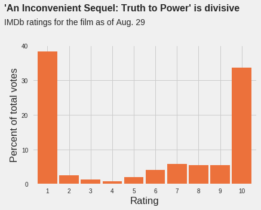

### Data Scientist

I'm a data scientist in Illinois. I help insurance companies and other businesses apply machine learning to make better decisions.

### Projects

#### [My data storytelling project](project1)

#### [Recreating a 538 visualization](https://colab.research.google.com/drive/1nZD17iA0YCTp07EOgFtmeNCYhTZfwW2V)

To practice creating data visualizations with Python, I recreated a plot from a 538 story about an Al Gore documentary.

### Contact
- [Email](mailto:rrherr@gmail.com)
- [LinkedIn](https://www.linkedin.com/in/ryan-herr-b5a8a77/)
